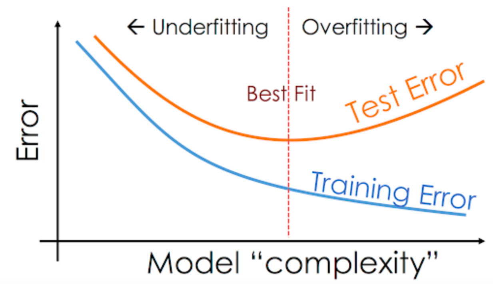

# Introduction to Machine Learning

Machine learning is a subfield of artificial intelligence (AI) that focuses on developing algorithms and models that enable computers to learn from data and make predictions or decisions without being explicitly programmed. It is a fundamental technology that powers a wide range of applications in various domains. In this introduction, we'll explore the basic concepts of machine learning.

## Features and Target

In machine learning, data is typically divided into two main components: features and a target variable.

- **Features**: Features are the input variables or attributes that the model uses to make predictions or decisions. These features can be quantitative (e.g., numerical values) or categorical (e.g., text or categories). For example, in a housing price prediction model, features might include the number of bedrooms, square footage, and neighborhood.

- **Target**: The target variable is the outcome or response variable that the model aims to predict. It represents what you want to learn from the data. In the housing price prediction example, the target variable would be the actual sale price of the house.

## Types of Machine Learning

1. **Supervised Learning**: In supervised learning, the algorithm is trained on a labeled dataset, where each data point has both features and a corresponding target variable. The goal is to learn a mapping from features to the target variable. Supervised learning includes subcategories like:

   - **Regression**: Regression models predict continuous numerical values. Examples include predicting house prices or stock prices.

   - **Classification**: Classification models predict categorical labels or classes. Examples include spam email detection or image classification.

2. **Unsupervised Learning**: Unsupervised learning deals with unlabeled data, where there is no target variable. The algorithm tries to discover patterns, relationships, or structures within the data. Unsupervised learning includes subcategories like:

   - **Clustering**: Clustering algorithms group similar data points together. K-Means clustering is a common example.

   - **Dimensionality Reduction**: Dimensionality reduction techniques aim to reduce the number of features while preserving important information, such as Principal Component Analysis (PCA).

3. **Reinforcement Learning**: Reinforcement learning is concerned with training agents to interact with an environment and make sequential decisions. It involves learning a policy that maximizes a reward signal. Applications include game playing and autonomous control.

4. **Semi-Supervised Learning and Self-Supervised Learning**: These are hybrid approaches that combine aspects of supervised and unsupervised learning to handle scenarios where only a portion of the data is labeled or when labels are expensive to obtain.

5. **Deep Learning**: Deep learning is a subset of machine learning that focuses on deep neural networks with multiple layers. It has achieved remarkable success in tasks like image recognition, natural language processing, and more.

Machine learning algorithms and techniques continue to evolve and have a profound impact on various industries. Understanding the fundamentals of machine learning is the first step towards harnessing its power for solving real-world problems.

## Overfitting and Underfitting

### Overfitting

Overfitting occurs when a machine learning model is too complex and captures noise or random fluctuations in the training data, rather than the underlying patterns. As a result, the model performs well on the training data but poorly on new, unseen data. Overfitting is often associated with models that are excessively flexible or have too many parameters.

**Example**: Imagine a polynomial regression model with a high-degree polynomial (e.g., degree 20) applied to a dataset with a simple linear relationship. The model might fit the training data perfectly but fail to generalize to new data.

### Underfitting

Underfitting, on the other hand, occurs when a machine learning model is too simplistic to capture the underlying patterns in the data. It results in poor performance both on the training data and on new data. Underfitting is often associated with models that are too rigid or have too few parameters.

**Example**: Consider a linear regression model applied to a dataset with a complex, nonlinear relationship. The linear model may not capture the nuances of the data, resulting in significant errors.

### Balancing Act

The goal in machine learning is to strike a balance between overfitting and underfitting. You want your model to be complex enough to capture the true underlying patterns in the data but not so complex that it fits noise.

**Regularization techniques**, such as L1 and L2 regularization, can help prevent overfitting by penalizing overly complex models. Cross-validation is a common practice to detect and mitigate overfitting and underfitting by splitting the data into training and validation sets.

In the following sections, we will dive deeper into supervised learning, a key area of machine learning, and explore techniques to build models that generalize well to new data.

# Introduction to Supervised Learning

Supervised learning is a category of machine learning where a model is trained on a labeled dataset, where each data example is associated with features and a target variable. The goal of supervised learning is to learn a relationship between the features and the target variable to make accurate predictions on new, unlabeled data.

## Components of Supervised Learning

1. **Dataset**:
   - **Features**: Features are the input variables of the model. They are represented as vectors and describe the data that the model will use for predictions. For example, in a real estate price prediction model, features might include the number of bedrooms, square footage, etc.

   - **Target**: The target variable is the value that the model aims to predict. It can be continuous (in the case of regression) or categorical (in the case of classification). For instance, in the real estate price prediction model, the target variable would be the actual sale price.

2. **Learning Algorithm**:
   - A learning algorithm is a set of rules or mathematical methods that the model follows to learn the relationship between the features and the target variable. Examples of supervised learning algorithms include linear regression, logistic regression, support vector machines (SVM), decision trees, and more.

3. **Theta Parameters**:
   - The theta parameters, often denoted as θ, are the coefficients adjusted by the learning algorithm to minimize prediction errors. The goal is to find the optimal values of θ that allow the model to better fit the training data. In linear regression, for example, θ represents the regression coefficients.

## Cost Function

The cost function is a measure of the error between the model's predictions and the actual values of the target variable. The objective of supervised learning is to minimize this cost function. Here are the cost function formulas for commonly used cases:

### For Regression:
$$
J(\theta) = \frac{1}{2m} \sum_{i=1}^{m} (h_{\theta}(x^{(i)}) - y^{(i)})^2
$$

Where:
- $J(\theta)$ is the cost function.
- $m$ is the number of training examples.
- $h_{\theta}(x^{(i)})$ is the model's prediction for example $i$.
- $y^{(i)}$ is the actual target value for example $i$.

### For Classification:
$$
J(\theta) = -\frac{1}{m} \sum_{i=1}^{m} [y^{(i)} \log(h_{\theta}(x^{(i)})) + (1 - y^{(i)}) \log(1 - h_{\theta}(x^{(i)}))]
$$

Where:
- $J(\theta)$ is the cost function.
- $m$ is the number of training examples.
- $h_{\theta}(x^{(i)})$ is the model's prediction for example $i$.
- $y^{(i)}$ is the actual target value for example $i$.

These cost functions evaluate the model's performance and guide the adjustment of theta parameters to minimize prediction errors. Ultimately, the goal of supervised learning is to create a model capable of making accurate predictions on new data based on provided features.

## Supervised Learning Algorithms

### Regression Algorithms

1. **Linear Regression**:
   - *Advantages*:
     - Simple and interpretable.
     - Provides a baseline for regression tasks.
   - *Disadvantages*:
     - Assumes a linear relationship, which may not be suitable for complex data.
   - *How it works*:
     - Linear regression models the relationship between the target variable and the features by fitting a linear equation.
     - It finds the best-fitting line (hyperplane) that minimizes the sum of squared errors between predicted and actual values.

2. **Polynomial Regression**:
   - *Advantages*:
     - Can model nonlinear relationships effectively.
     - Offers flexibility in fitting curves to data.
   - *Disadvantages*:
     - Susceptible to overfitting with high-degree polynomials.
   - *How it works*:
     - Polynomial regression extends linear regression by introducing polynomial terms (e.g., x^2, x^3) into the equation.
     - It fits a polynomial curve to the data, allowing for more complex relationships.

### Classification Algorithms

1. **k-Nearest Neighbors (k-NN)**:
   - *Advantages*:
     - Easy to understand and implement.
     - No assumptions about data distribution.
   - *Disadvantages*:
     - Sensitive to the choice of k.
     - Can be computationally expensive for large datasets.
   - *How it works*:
     - For a given data point, k-NN identifies the k nearest data points (neighbors) based on a distance metric (e.g., Euclidean distance).
     - The majority class among the k neighbors is assigned as the predicted class.

2. **Naive Bayes Classifier**:
   - *Advantages*:
     - Fast and efficient, especially for text classification.
     - Works well with high-dimensional data.
   - *Disadvantages*:
     - Assumes independence between features (may not hold in all cases).
     - Requires a large amount of training data for accurate estimation.
   - *How it works*:
     - Naive Bayes uses Bayes' theorem to calculate the probability of a data point belonging to a certain class.
     - It assumes that features are conditionally independent, making computations more tractable.

3. **Decision Trees**:
   - *Advantages*:
     - Easy to visualize and interpret.
     - Can handle both categorical and numerical features.
   - *Disadvantages*:
     - Prone to overfitting, especially with deep trees.
     - Can be unstable; small variations in data may result in different trees.
   - *How it works*:
     - A decision tree recursively splits the feature space into regions based on feature values.
     - It selects the best feature to split on at each node, aiming to maximize information gain or minimize impurity.

These descriptions provide insights into the functioning of each supervised learning algorithm, along with their respective advantages and disadvantages. Further details and implementation specifics can be covered in subsequent lessons.

